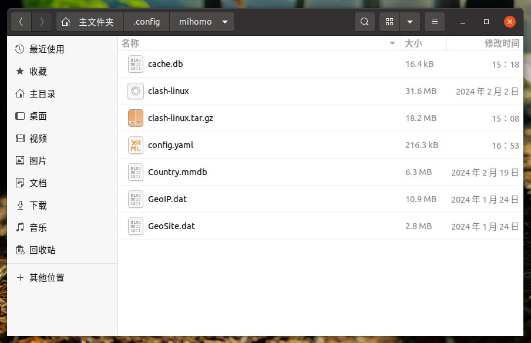
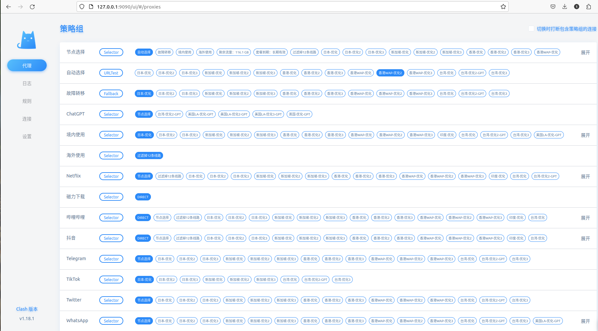

## clash安装教程

### 1

首先按照这个教程安装好clash linux版本

[V2free 文档中心](https://w1.v2free.net/doc/#/linux/clash)

不用管配置文件

将下来需要按照文档要求配置好网络代理 图形界面配置即可

安装好了没有软件快捷方式打开

### 2

接下来按照这个教程配置节点

https://w1.v2free.net/doc/#/linux/clashweb.html

下载代码

修改配置

1.找到安装路径中的yaml文件



找到可用的yaml文件，复制里面的内容到这个yaml文件中

内容格式大致如下：

```yaml
mixed-port: 7890  #端口注意修改
ipv6: true
udp: true
allow-lan: false
bind-address: '*'
mode: rule
log-level: info
unified-delay: true
experimental:
    ignore-resolve-fail: true
cfw-latency-timeout: 8000
cfw-latency-url: 'http://YouTube.com/generate_204'
cfw-conn-break-strategy: true
hosts:
    mtalk.google.com: 108.177.125.188
    services.googleapis.cn: 74.125.203.94
dns:
    enable: true
    listen: '127.0.0.1:1053'
    ipv6: true
    default-nameserver: [114.114.114.114, 223.5.5.5, 119.29.29.29]
    enhanced-mode: fake-ip
    fake-ip-range: 28.0.0.1/8
    use-hosts: true
...
```

按照教程在文件中添加内容

```yaml
external-controller: 127.0.0.1:9090 # 如果你不是从本机访问，需要从其它机器访问这个Clash Dashboard ,则改为：0.0.0.0:9090
external-ui: /etc/clash/clash-dashboard # clash-dashboard的路径；
secret: 'luan2002' # PaaRwW3B1Kj9 是登录web管理界面的密码，请自行设置你自己的,不要照抄教程中的密码；
```

保存文件内容


移动到`~/.config/mihomo/`目录

启动文件./clash-linux


访问127.0.0.1:9090/ui

界面如下：



首页第一个节点选择，可以设置为自动选择，也可以自己设置想选择的节点

下滑可以看到节点目录，可以测试节点的速度
