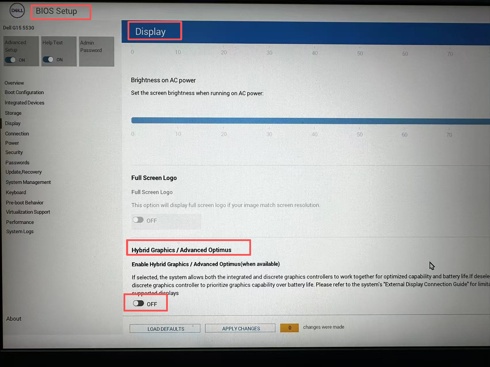
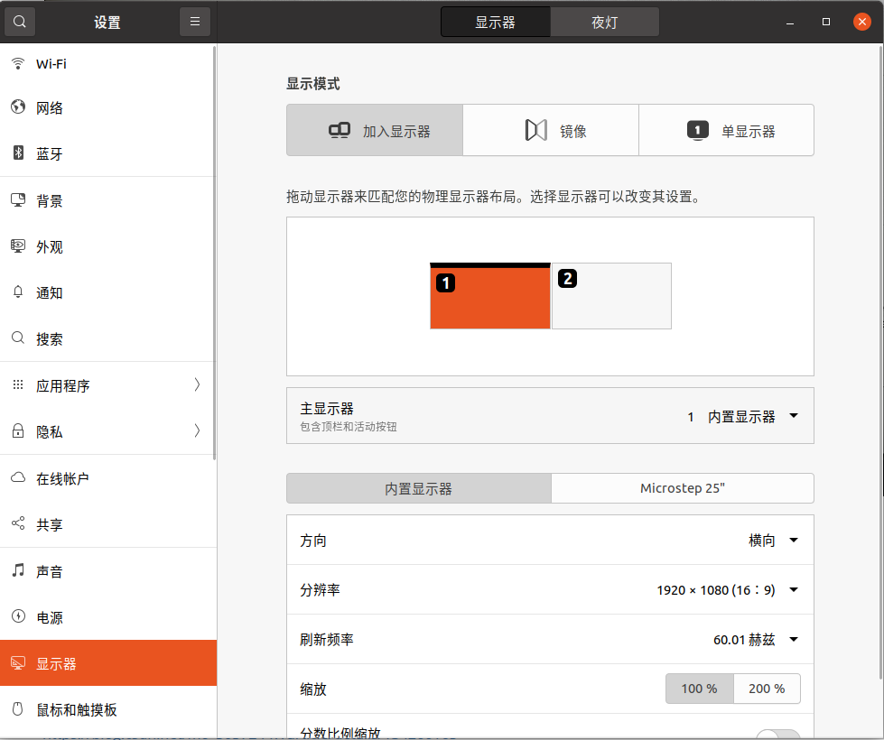
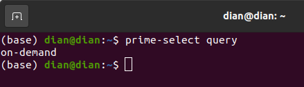
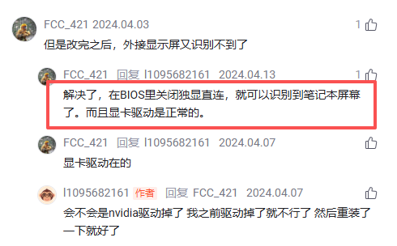

# ubuntu显示器问题


## 1.问题描述

ubuntu20.4，4070的显卡，已经安装了系统软件更新中推荐的驱动

插入HDMI线连接显示器，但是显示 未知的display


查看电脑显卡

```sh
prime-select query 
```

设置电脑显卡为intel

```bash
sudo prime-select intel
```

设置为intel之后，电脑内置屏幕有输出，显示桌面，但是外接显示器没有任何显示黑屏

命令行检测不到HDMI接口

并且输入nvidia-smi之后，显示没有驱动

```
sudo prime-select nvidia
```

设置电脑显卡为nvidia后，电脑内置屏幕处于开机命令行界面，外界显示器有输出，显示桌面

命令行检测不到电脑内置屏幕eDP接口

输入nvidia-smi显示驱动版本

```sh
sudo prime-select on-demand
```

设置混合模式之后，电脑直接无法进入系统，只有在恢复模式下设置为intel才能进入系统


问题总结：**无法设置双屏输出**


## 2.可能的原因

这可能与双 GPU 有关，因为 Intel GPU 通常输出到笔记本电脑屏幕，Nvidia GPU 通常输出到 HDMI 端口


## 3.解决方案

在BIOS中设置中关闭独显启动



结算画面



并且现在可以设置电脑为on-demand模式了，电脑可以开机进入桌面




参考博客：

https://blog.csdn.net/m0_50572447/article/details/134260165

https://blog.csdn.net/l1095682161/article/details/133715323

