# 任务三笔记


## 任务

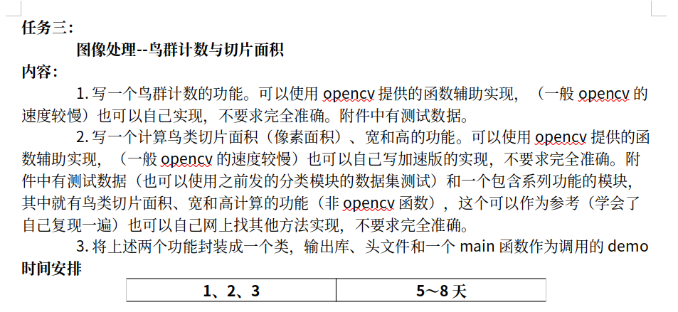


## **所给项目架构**

### **1.** **核心模块** **(**include/core/)

- ​	**core.h**: 定义核心数据结构

- ​	blob: 连通域目标信息（面积、形心、质心、边界框等）

- ​	track_blob: 航迹关联目标信息（包含历史轨迹、速度等）

- ​	bery_blob: 鸟群目标信息

- ​	aligned_mem: 32字节对齐内存管理

### **2.** **计算模块** **(**include/calculate/)

- ​	**calculate.h/cpp**: 统计计算

- ​	getMean(): 计算均值

- ​	getMeanStd(): 一步计算均值、标准差、方差

### **3.** **转换模块** **(**include/convert/)

- ​	**format.h/cpp**: CPU 图像格式转换

- ​	线性拉伸（balance）

- ​	Gray 转 RGBA

- ​	Bayer 转 RGB/RGBA（切片）

- ​	快速缩放（resizeFast）

- ​	**cuda_format.cu**: CUDA 格式转换

- ​	**cuda_clahe.h/cu/cpp**: CUDA CLAHE（对比度受限自适应直方图均衡化）

- ​	支持 8 位和 16 位图像

- ​	用于图像增强

### **4.** **检测模块** **(**include/detect/)

- ​	**bwlabel.h/cpp**: 8 连通域标记

- ​	两阶段连通域标记，边界优化

- ​	**slice_seg.h/cpp**: 切片分割

- ​	切片 + 阈值计算 + 分割 + 开运算

- ​	支持 8 位和 16 位灰度图

- ​	**cuda_hvs.h/cu**: CUDA 显著性滤波（HVS）

- ​	最小值/最大值滤波

- ​	支持对消（背景减除）

- ​	基于尺度 11

- ​	**cuda_diff.cu**: CUDA 差分处理

- ​	**track_ass.h/cpp**: 航迹关联

- ​	基于二维卡尔曼滤波（x、v 和 y、v）

- ​	最近邻关联

- ​	支持预测和丢失处理

- ​	**cluster.h/cpp**: 聚类

- ​	基于外接矩形边界距离聚类

- ​	支持普通目标和鸟群聚类

### **5.** **拼接模块** **(include/stitch/**)

- ​	**stitch.h/cpp**: 全景拼接

- ​	使用先验映射数据快速拼接

- ​	支持灰度图和 RGB 图

- ​	支持均值滤波去白边


## 实现效果

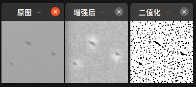

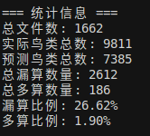


修改自适应阈值后的效果：

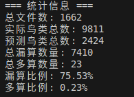

形态学操作改为2*2

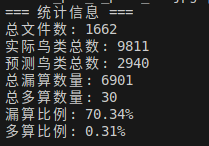

去噪改为5

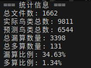

不计算联通区域，计算轮廓

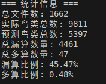

yjw的代码

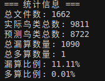


## opencv

https://www.runoob.com/opencv/cpp-opencv-basic.html


读取图像

```c++
cv::Mat image = cv::imread("image.jpg", cv::IMREAD_COLOR); // 读取的彩色图片
cv::Mat image = cv::imread(imagePath, cv::IMREAD_GRAYSCALE); // 读取的是黑白的图片
```

小技巧：

如果需要使用彩色图片，可以先读取彩色图片，三通道，之后如果需要单通道黑白图片，再转换一下即可

```c++
cv::Mat gray_image;
cv::cvtColor(rgb_image, gray_image, cv::COLOR_BGR2GRAY);
```

直接设置读取灰白图片存在的问题：

一个大项目，会一次直接读取很多图片放在内存中，后续会进行一系列的操作，例如

图像增强，图像识别，图像检测等操作，只会进行一次的图像读取，是彩色的

后续拿到的都是彩色图像的引用或者指针等

如果需要用到黑白图片，自己转换即可


### Mat内存结构

Mat是一个指针，是Matrix（矩阵）的缩写

cv::Mat 内部包含：

- 数据指针：指向实际的像素/数据

- 尺寸信息：行数、列数

- 通道数：单通道（灰度）或 3 通道（BGR）

- 数据类型：如 CV_8UC1（8 位无符号单通道）、CV_8UC3（8 位无符号 3 通道）

- 引用计数：用于内存管理（自动释放）


### 引用计数

引用计数记录有多少个变量指向同一块内存。当计数为 0 时，自动释放内存。

#### 工作原理

```c++
cv::Mat image1 = cv::imread("test.jpg", cv::IMREAD_GRAYSCALE);
// 此时：image1 指向一块内存，引用计数 = 1

cv::Mat image2 = image1;  // 拷贝赋值
// 此时：image1 和 image2 指向同一块内存，引用计数 = 2
// 注意：这里并没有真正复制像素数据，只是复制了 Mat 的元信息（尺寸、通道等）

cv::Mat image3 = image1.clone();  // 深拷贝
// 此时：image3 有自己独立的内存，引用计数 = 1（新内存）
// image1 和 image2 的引用计数仍然是 2
```

#### 实际例子

```c++
cv::Mat original = cv::imread("bird.jpg", cv::IMREAD_GRAYSCALE);
// original 引用计数 = 1

cv::Mat copy1 = original;  // 浅拷贝（共享数据）
cv::Mat copy2 = original;  // 浅拷贝（共享数据）
// 现在 original, copy1, copy2 都指向同一块内存
// 引用计数 = 3

// 如果修改 copy1，会发生什么？
copy1.at<uchar>(0, 0) = 255;  
// OpenCV 检测到要修改共享的数据，会自动创建副本（写时复制）
// 现在 copy1 有独立内存，original 和 copy2 仍然共享
// original 和 copy2 引用计数 = 2
// copy1 引用计数 = 1

// 当变量离开作用域或赋值新值
copy1 = cv::Mat();  // copy1 不再指向那块内存  创建一个空的OpenCV 矩阵（Mat）对象，并将其赋值给变量 copy1
// copy1 原来指向的内存引用计数 -1

// 当所有变量都销毁时
// 引用计数变为 0，内存自动释放
```

#### 实际例子

```C++
cv::Mat image = cv::imread("test.jpg", cv::IMREAD_GRAYSCALE);  // 全局变量

for (int i = 0; i < 10; i++) {
    cv::Mat image1 = image;  // 浅拷贝，共享数据
    // 此时：image 和 image1 指向同一块内存，引用计数 = 2
    
    // 情况1：只读操作（不会触发复制）
    uchar pixel_value = image1.at<uchar>(0, 0);  // 读取，不复制
    // image 不受影响，仍然共享数据
    
    // 情况2：修改操作（会触发写时复制）
    image1.at<uchar>(0, 0) = 255;  // 修改像素值
    // OpenCV 检测到要修改共享数据，自动创建副本
    // 现在 image1 有独立的内存，image 保持原样
    // image 的引用计数 = 1，image1 的引用计数 = 1
    
    // 情况3：使用会修改数据的函数
    cv::GaussianBlur(image1, image1, cv::Size(5, 5), 0);
    // 这会修改 image1，触发写时复制
    // image 仍然不受影响
    
}  // image1 离开作用域，引用计数 -1，如果变为 0 则释放内存
// image 仍然存在，数据未被修改
```

```c++
cv::Mat image;  // 全局变量
// ... 初始化 image ...

for (int i = 0; i < 10; i++) {
    cv::Mat image1 = image;  // 浅拷贝
    // 此时：
    // - image 和 image1 共享同一块内存
    // - 引用计数 = 2
    // - 没有复制像素数据，只是复制了 Mat 的元信息（尺寸、通道等）
}
```

#### 疑问

浅拷贝共享内存，如果修改了数据，就会重新分配内存，变成深拷贝

浅拷贝可以共享参数，只能看？有什么作用呢？


### **图像阈值处理**

```c++
retval, dst = cv2.threshold(src, thresh, maxval, type)
```

#### 参数说明

- `src`: 输入图像，通常为灰度图像。
- `thresh`: 设定的阈值。
- `maxval`: 当像素值超过（或小于，根据类型）阈值时，赋予的新值。
- `type`: 阈值处理的类型，常见的类型有：
  - `cv2.THRESH_BINARY`: 如果像素值大于阈值，则赋予 `maxval`，否则赋予 `0`。
  - `cv2.THRESH_BINARY_INV`: 与 `cv2.THRESH_BINARY` 相反，如果像素值大于阈值，则赋予 `0`，否则赋予 `maxval`。
  - `cv2.THRESH_TRUNC`: 如果像素值大于阈值，则赋予阈值，否则保持不变。
  - `cv2.THRESH_TOZERO`: 如果像素值大于阈值，则保持不变，否则赋予 `0`。
  - `cv2.THRESH_TOZERO_INV`: 与 `cv2.THRESH_TOZERO` 相反，如果像素值大于阈值，则赋予 `0`，否则保持不变。

#### 返回值

- `retval`: 实际使用的阈值（在某些情况下可能与设定的阈值不同）。

- `dst`: 处理后的图像。

  

### 自适应阈值处理

在某些情况下，图像的亮度分布不均匀，使用固定的阈值可能无法得到理想的效果。自适应阈值处理通过为图像的不同区域计算不同的阈值，从而更好地处理这种情况。

#### 函数原型

```
dst = cv2.adaptiveThreshold(src, maxValue, adaptiveMethod, thresholdType, blockSize, C)
```

#### 参数说明

- `src`: 输入图像，通常为灰度图像。
- `maxValue`: 当像素值超过（或小于，根据类型）阈值时，赋予的新值。
- `adaptiveMethod`: 自适应阈值计算方法，常见的类型有：
  - `cv2.ADAPTIVE_THRESH_MEAN_C`: 阈值是邻域的平均值减去常数 `C`。
  - `cv2.ADAPTIVE_THRESH_GAUSSIAN_C`: 阈值是邻域的加权平均值减去常数 `C`，权重由高斯函数确定。
- `thresholdType`: 阈值处理的类型，通常为 `cv2.THRESH_BINARY` 或 `cv2.THRESH_BINARY_INV`。
- `blockSize`: 计算阈值时使用的邻域大小，必须为奇数。
- `C`: 从平均值或加权平均值中减去的常数。

#### 返回值

- `dst`: 处理后的图像。


### 鸟类识别逻辑

原图是天空中出现了鸟群，背景（天空）是浅色，鸟类是黑色

白色像素是255 黑色像素是0

图像分割之后想要的效果 鸟类是白色，天空背景是黑色

cv::THRESH_BINARY_INV 大于阈值，赋值为0  

天空背景是浅色，像素值大，用cv::THRESH_BINARY_INV直接变成黑色

```c++
cv::threshold(denoised, thresh_image, thres, 255, cv::THRESH_BINARY_INV)
```

或者换一种写法

```C++
// 天空像素大，浅色，赋值为255白色
//后续需要反转图像，将背景变成黑色
cv::threshold(denoised, thresh_image, thres, 255, cv::THRESH_BINARY)
cv::bitwise_not(thresh_image, thresh_image);
```


## 注释

### 常用的 Doxygen 标签

- @brief：简要说明

- @param：参数说明

- @return：返回值说明

- @see：参考

- @note：注意事项

- @warning：警告

 

## 跑通模型

```shell
./sliceseg_test 
bash: ./sliceseg_test：无法执行二进制文件: 可执行文件格式错误
```

问题原因：可执行文件是为 ARM aarch64 编译的，而当前系统是 x86_64，架构不匹配。需要重新编译。先清理旧的构建文件，然后重新编译：

```shell
cd /home/dian/project/cProject/allin_fast/samples/SliceSeg_test/sliceseg_test
rm -rf ../build-sliceseg_test-Desktop-Release/*.o ../build-sliceseg_test-Desktop-Release/sliceseg_test

which qmake
/usr/bin/qmake

cd /home/dian/project/cProject/allin_fast/samples/SliceSeg_test/sliceseg_test && qmake -v
QMake version 3.1
Using Qt version 5.12.8 in /usr/lib/x86_64-linux-gnu

//重新生成 Makefile 并编译
cd /home/dian/project/cProject/allin_fast/samples/SliceSeg_test/sliceseg_test
//读取当前目录下的 sliceseg_test.pro 项目配置文件，生成一个用于 Release 版本编译的 Makefile，并将其保存到专门的构建目录中
qmake sliceseg_test.pro -o ../build-sliceseg_test-Desktop-Release/Makefile

//执行项目的清理操作，但只显示前10行输出信息，用于快速查看清理过程的开头部分
cd /home/dian/project/cProject/allin_fast/samples/SliceSeg_test/build-sliceseg_test-Desktop-Release
// 输出
make clean 2>&1 | head -10
rm -f moc_predefs.h
rm -f main.o slice_seg.o format.o bwlabel.o
rm -f *~ core *.core

cd /home/dian/project/cProject/allin_fast/samples/SliceSeg_test/build-sliceseg_test-Desktop-Release 
make -j$(nproc) 2>&1 | tail -50
//输出
../sliceseg_test/main.cpp:177:13: warning: this ‘if’ clause does not guard... [-Wmisleading-indentation]
  177 |             if(x>picd[4])picd[4]=x;        if(y>picd[5])picd[5]=y;
      |             ^~
g++ -Wl,-O1 -Wl,-z,origin -Wl,-rpath,\$ORIGIN/../modules/allinhvsfilter/lib -o sliceseg_test main.o slice_seg.o format.o bwlabel.o   -L/usr/local/cuda/lib64/ /usr/local/lib/libopencv_highgui.so /usr/local/lib/libopencv_core.so /usr/local/lib/libopencv_imgproc.so /usr/local/lib/libopencv_imgcodecs.so /usr/local/lib/libopencv_video.so /usr/local/lib/libopencv_videoio.so -L../modules/sl_convolution/lib -lconv5x5 -L../modules/allinhvsfilter/lib -lallin_hvs_filter /usr/local/cuda/lib64/libcudart.so /usr/local/cuda/lib64/libnppicc.so /usr/local/cuda/lib64/libnppig.so /usr/local/cuda/lib64/libnppitc.so /usr/local/cuda/lib64/libnppidei.so /usr/lib/x86_64-linux-gnu/libQt5Widgets.so /usr/lib/x86_64-linux-gnu/libQt5Gui.so /usr/lib/x86_64-linux-gnu/libQt5Core.so /usr/lib/x86_64-linux-gnu/libGL.so -lpthread   
/usr/bin/ld: 当搜索用于 ../modules/sl_convolution/lib/libconv5x5.so 时跳过不兼容的 -lconv5x5
/usr/bin/ld: 找不到 -lconv5x5
collect2: error: ld returned 1 exit status
make: *** [Makefile:156：sliceseg_test] 错误 
//链接错误：找不到 libconv5x5.so 或架构不匹配。检查该库文件
ls -lh /home/dian/project/cProject/allin_fast/samples/SliceSeg_test/modules/sl_convolution/lib/
总用量 32K
-rwxrwxr-x 1 dian dian 32K 9月  24 15:42 libconv5x5.so
file /home/dian/project/cProject/allin_fast/samples/SliceSeg_test/modules/sl_convolution/lib/libconv5x5.so 2>/dev/null || echo "文件不存在"
/home/dian/project/cProject/allin_fast/samples/SliceSeg_test/modules/sl_convolution/lib/libconv5x5.so: ELF 64-bit LSB shared object, ARM aarch64, version 1 (SYSV), dynamically linked, BuildID[sha1]=b634b96fb27ec3e8c02bc8b5876e69976454fc77, not stripped
ls -lh /home/dian/project/cProject/allin_fast/samples/SliceSeg_test/modules/allinhvsfilter/lib/
总用量 260K
-rwxrwxr-x 1 dian dian 260K 11月  7 16:01 liballin_hvs_filter.so
//libconv5x5.so 也是 ARM 架构。检查另一个库，然后重新编译这些模块
file /home/dian/project/cProject/allin_fast/samples/SliceSeg_test/modules/allinhvsfilter/lib/liballin_hvs_filter.so
/home/dian/project/cProject/allin_fast/samples/SliceSeg_test/modules/allinhvsfilter/lib/liballin_hvs_filter.so: ELF 64-bit LSB shared object, x86-64, version 1 (SYSV), dynamically linked, BuildID[sha1]=de02f97ae877c3a9ab78efb35ecc4b3bacd29b4c, not stripped
libconv5x5.so 是 ARM 架构，需要重新编译。先检查 CUDA 是否可用，然后重新编译该模块：
nvcc --version 
nvcc: NVIDIA (R) Cuda compiler driver
Copyright (c) 2005-2022 NVIDIA Corporation
Built on Wed_Sep_21_10:33:58_PDT_2022
Cuda compilation tools, release 11.8, V11.8.89
Build cuda_11.8.r11.8/compiler.31833905_0
nvidia-smi --query-gpu=compute_cap --format=csv,noheader 2>&1 | head -1
8.9
cd /home/dian/project/cProject/allin_fast/samples/SliceSeg_test/modules/sl_convolution && cat build.sh
#!/bin/bash
CUDA_PATH=/usr/local/cuda
SRC_FILE=src/sl_conv.cu
OUT_FILE=./lib/libconv5x5.so

# ?????
$CUDA_PATH/bin/nvcc -shared -Xcompiler "-fPIC" $SRC_FILE -o $OUT_FILE -lcudart -arch=sm_87
echo "so: $OUT_FILE"

cd /home/dian/project/cProject/allin_fast/samples/SliceSeg_test/modules/sl_convolution && mv lib/libconv5x5.so lib/libconv5x5.so.arm_backup 2>/dev/null; echo "已备份旧库"
cd /home/dian/project/cProject/allin_fast/samples/SliceSeg_test/modules/sl_convolution && bash build.sh 2>&1
so: ./lib/libconv5x5.so
file /home/dian/project/cProject/allin_fast/samples/SliceSeg_test/modules/sl_convolution/lib/libconv5x5.so
/home/dian/project/cProject/allin_fast/samples/SliceSeg_test/modules/sl_convolution/lib/libconv5x5.so: ELF 64-bit LSB shared object, x86-64, version 1 (SYSV), dynamically linked, BuildID[sha1]=eef29aae6ef741dd00d50ffd2914458b62147da0, not stripped
库已重新编译为 x86-64。重新编译主程序
cd /home/dian/project/cProject/allin_fast/samples/SliceSeg_test/build-sliceseg_test-Desktop-Release && make -j$(nproc) 2>&1 | tail -30
g++ -Wl,-O1 -Wl,-z,origin -Wl,-rpath,\$ORIGIN/../modules/allinhvsfilter/lib -o sliceseg_test main.o slice_seg.o format.o bwlabel.o   -L/usr/local/cuda/lib64/ /usr/local/lib/libopencv_highgui.so /usr/local/lib/libopencv_core.so /usr/local/lib/libopencv_imgproc.so /usr/local/lib/libopencv_imgcodecs.so /usr/local/lib/libopencv_video.so /usr/local/lib/libopencv_videoio.so -L../modules/sl_convolution/lib -lconv5x5 -L../modules/allinhvsfilter/lib -lallin_hvs_filter /usr/local/cuda/lib64/libcudart.so /usr/local/cuda/lib64/libnppicc.so /usr/local/cuda/lib64/libnppig.so /usr/local/cuda/lib64/libnppitc.so /usr/local/cuda/lib64/libnppidei.so /usr/lib/x86_64-linux-gnu/libQt5Widgets.so /usr/lib/x86_64-linux-gnu/libQt5Gui.so /usr/lib/x86_64-linux-gnu/libQt5Core.so /usr/lib/x86_64-linux-gnu/libGL.so -lpthread  
成功

file /home/dian/project/cProject/allin_fast/samples/SliceSeg_test/build-sliceseg_test-Desktop-Release/sliceseg_test
/home/dian/project/cProject/allin_fast/samples/SliceSeg_test/build-sliceseg_test-Desktop-Release/sliceseg_test: ELF 64-bit LSB shared object, x86-64, version 1 (SYSV), dynamically linked, interpreter /lib64/ld-linux-x86-64.so.2, BuildID[sha1]=720fd62927315354c1fea8ae694d5f660bfa4a8d, for GNU/Linux 3.2.0, not stripped

cd /home/dian/project/cProject/allin_fast/samples/SliceSeg_test/build-sliceseg_test-Desktop-Release && ./sliceseg_test 
./sliceseg_test: error while loading shared libraries: libconv5x5.so: cannot open shared object file: No such file or directory
cd /home/dian/project/cProject/allin_fast/samples/SliceSeg_test/build-sliceseg_test-Desktop-Release LD_LIBRARY_PATH=../modules/sl_convolution/lib:../modules/allinhvsfilter/lib:$LD_LIBRARY_PATH ./
```


创建脚本文件

```sh
#!/bin/bash
# sliceseg_test 运行脚本
# 自动设置库路径并运行程序

# 获取脚本所在目录
SCRIPT_DIR="$(cd "$(dirname "${BASH_SOURCE[0]}")" && pwd)"

# 设置库路径
export LD_LIBRARY_PATH="${SCRIPT_DIR}/../modules/sl_convolution/lib:${SCRIPT_DIR}/../modules/allinhvsfilter/lib:${LD_LIBRARY_PATH}"

# 运行程序
cd "${SCRIPT_DIR}"
./sliceseg_test "$@"
```


## .pro

这是一个 Qt 项目配置文件（.pro 文件），用于定义项目的编译设置、源文件、依赖库等。qmake 会读取它并生成 Makefile。

```sh
qmake test_sliceseg_new.pro
make
./build_test.sh
```


## 创建新测试文件

```ABAP
编写源代码
    ↓
test_sliceseg_new.cpp
    ↓
编写项目配置
    ↓
test_sliceseg_new.pro
    ↓
编写构建脚本
    ↓
build_test.sh
    ↓
运行构建脚本
    ↓
bash build_test.sh
    ↓
自动执行：
1. 创建 build-test_sliceseg_new/ 目录
2. 生成 Makefile
3. 编译生成可执行文件
    ↓
得到可执行文件
    ↓
build-test_sliceseg_new/test_sliceseg_new
```

./build_test.sh执行后会生成一个文件夹（build-test_sliceseg_new），里面包含：

qmake 生成的文件：Makefile、.qmake.stash

make 编译生成的文件：多个 .o 目标文件

最终的可执行文件：test_sliceseg_new


## 图像分割

- 从大图中提取目标区域（切片）

- 计算自适应阈值

- 进行二值化分割

- 形态学处理

- 连通域分析

- 更新目标信息


## 连通域分析之两遍扫描法

(Two-Pass)

◆ copyMakeBorder()

```c++
//对待测连通域的输入图像进行一个向上和向左的边界外推一个像素单位的操作，外推像素的像素值为0
Mat extrapolationImg;//外推图像
copyMakeBorder(src, extrapolationImg, 1, 0, 1, 0, 0);

void cv::cuda::copyMakeBorder(InputArray	src,
OutputArray	dst,
int	top,
int	bottom,
int	左,
int	右,
int	borderType, // 0默认是常量填充
Scalar	value = Scalar(),
Stream &	stream = Stream::Null() )
```


```C
upPixel = (int)extrapolationImg.at<uchar>(i - 1, j);
```

at<uchar>(i - 1, j):

at<uchar> 是 OpenCV 提供的函数，用来访问图像中某个像素的值。uchar 表示图像数据类型为 无符号字符类型，即每个像素值为 0 到 255 的整数，通常用于表示灰度图像。

(i - 1, j) 表示要访问的位置为 extrapolationImg 图像中 第 i-1 行、第 j 列 的像素值。这个位置是当前像素 extrapolationImg.at<uchar>(i, j) 的上方像素。

将 at<uchar>(i - 1, j) 返回的 uchar 类型（通常是一个 unsigned char）转换为 int 类型。

这通常是为了方便后续操作，因为 uchar 类型的值范围为 0 到 255，但在某些情况下，可能需要将其转换为 int 类型进行计算。


### ++i

```c
int fa[MAXN];
inline void init(int n)
{
    for (int i = 1; i <= n; ++i)
        fa[i] = i;
}
```

for循环中++i 和i++功能相同，但是++i性能稍好一点，原因：

| 操作  | 内存操作       | 临时对象 | 返回值类型 |
| ----- | -------------- | -------- | ---------- |
| `++i` | 直接修改i      | 无       | 引用       |
| `i++` | 修改i+创建副本 | 有       | 值（副本） |


**二值矩阵 (1为前景, 0为背景)**

| 行\列 | 1    | 2    | 3    | 4    | 5    | 6    | 7    |      |
| :---: | ---- | ---- | ---- | ---- | ---- | ---- | ---- | ---- |
| **1** | 0    | 0    | 1    | 0    | 0    | 1    | 0    |      |
| **2** | 1    | 1    | 1    | 0    | 1    | 1    | 1    |      |
| **3** | 0    | 0    | 1    | 0    | 0    | 1    | 0    |      |
| **4** | 0    | 1    | 1    | 0    | 1    | 1    | 0    |      |


| 0    | 0    | 0    | 0    | 1    | 0    | 1    | 1    |
| ---- | ---- | ---- | ---- | ---- | ---- | ---- | ---- |
| 1    | 0    | 0    | 1    | 1    | 0    | 1    | 0    |
| 1    | 0    | 1    | 0    | 1    | 0    | 0    | 1    |
| 1    | 0    | 1    | 0    | 1    | 0    | 1    | 1    |
| 1    | 1    | 1    | 1    | 1    | 1    | 0    | 0    |
| 0    | 0    | 0    | 0    | 0    | 1    | 0    | 1    |
| 1    | 0    | 1    | 0    | 1    | 1    | 0    | 1    |
| 1    | 1    | 1    | 1    | 1    | 1    | 0    | 0    |


### 1.邻域

与像素（x,y）对应的点的集合{(x+p,y+q); (p,q)为一对有意义的整数}，称之为像素(x,y)的邻域。离散图像处理中常取[4邻域](https://zhida.zhihu.com/search?content_id=175702581&content_type=Article&match_order=1&q=4邻域&zhida_source=entity)和[8邻域](https://zhida.zhihu.com/search?content_id=175702581&content_type=Article&match_order=1&q=8邻域&zhida_source=entity)，并分别记作：

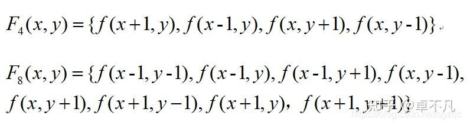

### 2.连通

像素f(x,y) = f(x+i,y+j)，其中i,j在图像R内存在。f(x,y)与f(x+i,y+j）周围中的邻接点存在4点邻域和8点邻域，4邻接一共4个点，即上下左右，如下左图所示。

8邻接的点一共有8个，包括了对角线位置的点，如下右图所示:

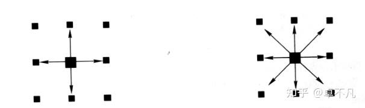

### 3.距离

街区距离：两个像素点x方向和y方向的距离之和；
棋盘距离：两个像素点x方向距离和y方向距离的最大值。


### 4.两遍扫描法

参考：https://blog.csdn.net/qq_41588862/article/details/129145973

从上到下，从左到右遍历图像，为每一个非零元素赋予一个数字标签(0像素的数字标签默认为数字0)。从遍历顺序来看访问的当前像素点的**正上方像素点**和**正左方的像素点**均已被赋予了数字标签；

**步骤一**

根据当前像素的**正上方**和**正左方**元素判断当前像素的标签。当前像素点为非零像素时，有以下四种情况：

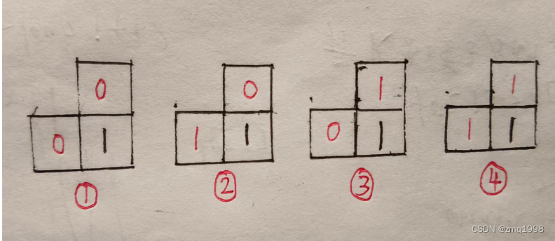

1):当前像素点的上方邻域和左侧邻域的像素点均为零，则赋予当前像素点一个新的数字标签（1.2.3.4...），同时将该标签值记录下来；
2):当前像素点的上方邻域像素点为零，左侧邻域像素点不为零，则当前像素点的数字标签与左侧像素点的数字标签一致；
3):当前像素点的上方邻域像素点不为零，左侧邻域像素点为零，则当前像素点的数字标签与上方像素点的数字标签一致；
4):当前像素点的上方邻域和左侧邻域的像素点均不为零，则当前像素的数字标签为左侧邻域和上方邻域像素的数字标签的最小值，**并且需要更新标注数组中的值**

**步骤二**

路径压缩（包含并查集的知识）

参考：https://zhuanlan.zhihu.com/p/93647900

**步骤三**

第二遍扫描（修改dst标记，对应路径压缩）

**步骤四**

标签映射


**例子，配合博客食用**

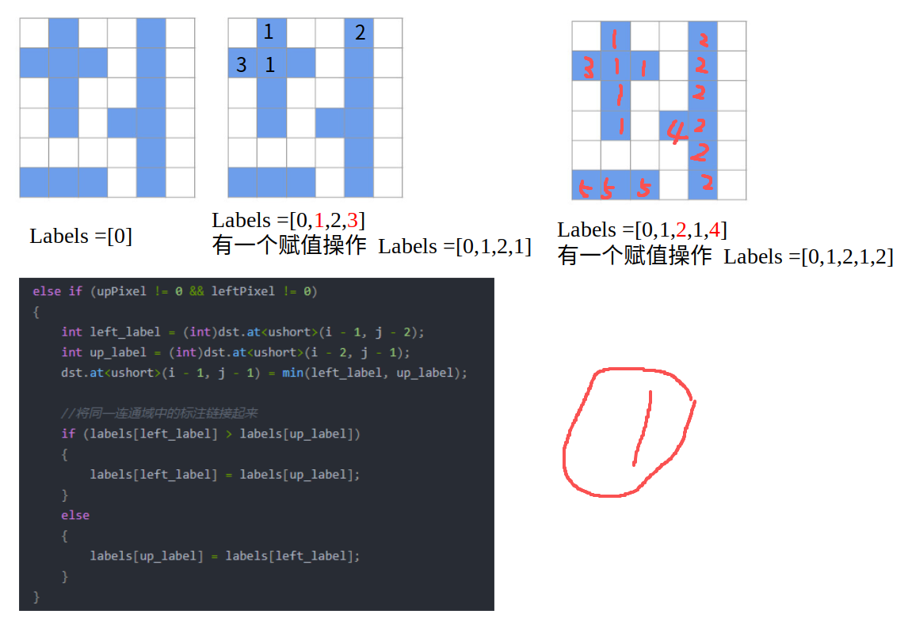

1

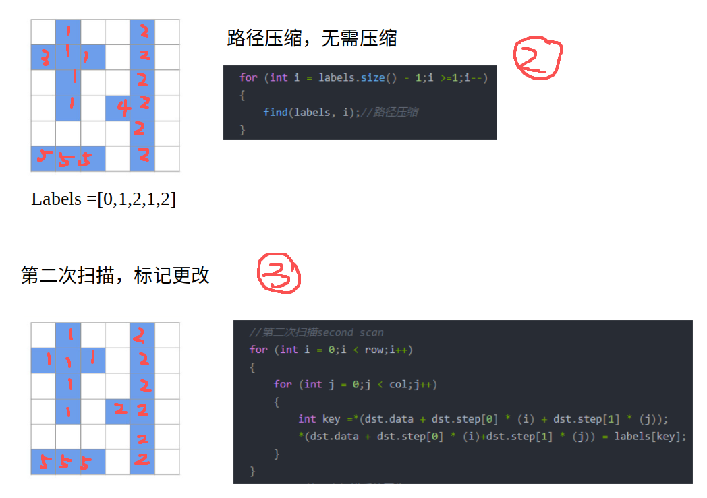

1

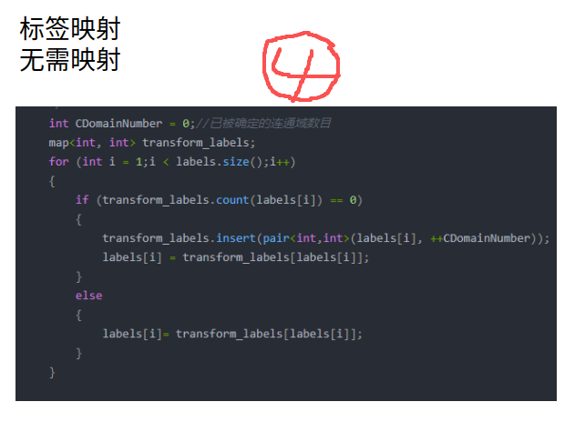

**例子**

路径合并

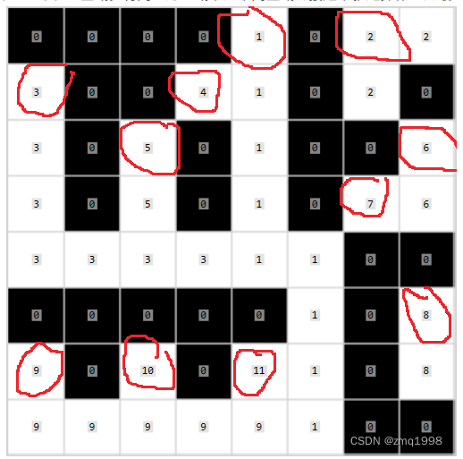

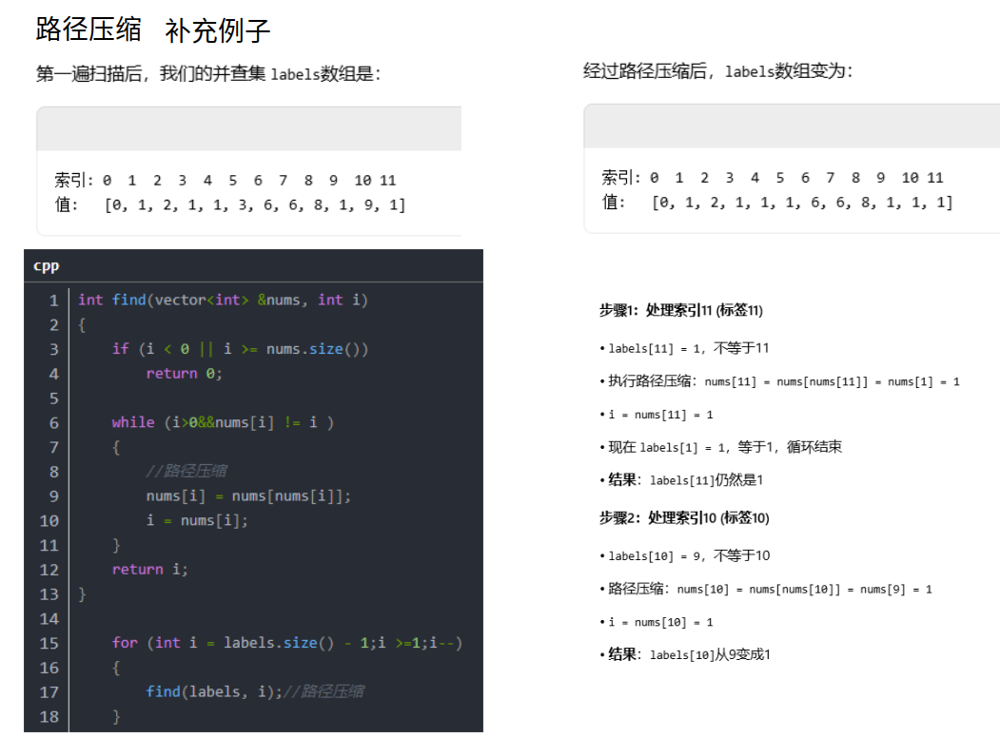

路径压缩：labels数组中放的当前索引的父节点，如果当前索引的父节点就是根节点，结束

如果当前索引的父节点不是根节点，当前索引指向祖父节点，依次类推

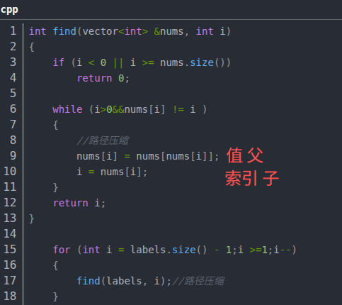

映射

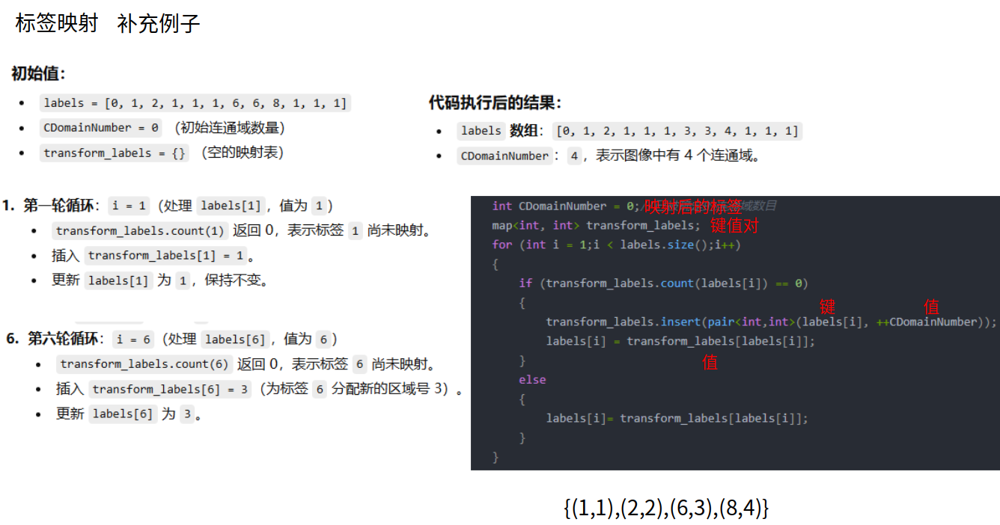


## 并查集

### 1.初始化

初始化，每个元素的父节点等于自己

```c
int fa[MAXN];
inline void init(int n)
{
    for (int i = 1; i <= n; ++i)
        fa[i] = i;
}
```

### 2.查询

```c
int find(int x)
{
    if(x == fa[x])
        return x;
    else{
        fa[x] = find(fa[x]);  //父节点设为根节点
        return fa[x];         //返回父节点
    }
}
```

### 3.合并

```c
inline void merge(int i, int j)
{
    fa[find(i)] = find(j);
}
```

例子

| 索引 | 0    | 1    | 2    | 3    | 4    | 5    |
| ---- | ---- | ---- | ---- | ---- | ---- | ---- |
| 值   | 1    | 2    | 3    | 4    | 5    | 5    |

### 执行过程分解

**第1次调用：find(1)**

- x = 1, fa[1] = 2 ≠ 1

执行 `fa[1] = find(fa[1])`即 `fa[1] = find(2)`

- **递归调用 find(2)**

**第2次调用：find(2)**

- x = 2, fa[2] = 3 ≠ 2

执行 `fa[2] = find(fa[2])`即 `fa[2] = find(3)`

- **递归调用 find(3)**

**第3次调用：find(3)**

- x = 3, fa[3] = 4 ≠ 3

执行 `fa[3] = find(fa[3])`即 `fa[3] = find(4)`

- **递归调用 find(4)**

**第4次调用：find(4)**

- x = 4, fa[4] = 5 ≠ 4

执行 `fa[4] = find(fa[4])`即 `fa[4] = find(5)`

- **递归调用 find(5)**

**第5次调用：find(5)**

- x = 5, fa[5] = 5 ✓ (找到根节点！)

- **返回 5**

**现在开始回溯：**

**回到 find(4)：**

- fa[4] = find(5) 的结果是 5

所以 fa[4] = 5

- **返回 5**

**回到 find(3)：**

- fa[3] = find(4) 的结果是 5

所以 fa[3] = 5

- **返回 5**

**回到 find(2)：**

- fa[2] = find(3) 的结果是 5

所以 fa[2] = 5

- **返回 5**

**回到 find(1)：**

- fa[1] = find(2) 的结果是 5

所以 fa[1] = 5

- **返回 5**

### 路径压缩后的结果

执行 `find(1)`后，树结构变成了：

```

1 → 5 (根节点)
2 → 5
3 → 5  
4 → 5
5 → 5
```