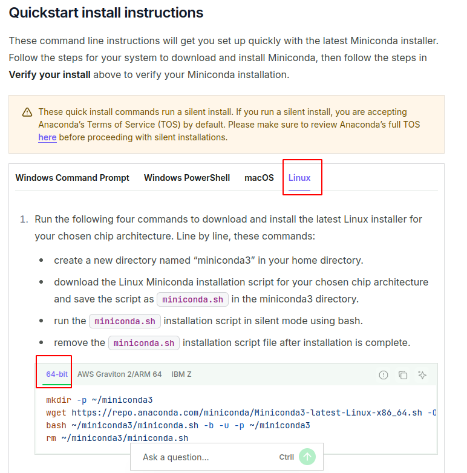

# ubuntu20.04配置pytorch环境


参考文档

https://blog.csdn.net/m0_55127902/article/details/135677560


## 1.安装miniconda

https://www.anaconda.com/docs/getting-started/miniconda/install



命令

```shell
mkdir -p ~/miniconda3
wget https://repo.anaconda.com/miniconda/Miniconda3-latest-Linux-x86_64.sh -O ~/miniconda3/miniconda.sh
bash ~/miniconda3/miniconda.sh -b -u -p ~/miniconda3
rm ~/miniconda3/miniconda.sh

source ~/miniconda3/bin/activate
conda init --all

~/miniconda3/bin/conda init bash
~/miniconda3/bin/conda init zsh
```


## 2. miniconda创建Pytorch虚拟环境

```shell
// 创建
conda create -n pytorch python=3.8
// 激活
conda activate pytorch
```

查看/删除虚拟环境

```shell
# 查看所有环境
conda env list

# 确保不在要删除的环境中（如在，先退出）
conda deactivate

# 删除 test_env 环境
conda remove -n test_env --all

# 再次查看确认已删除
conda env list
```

